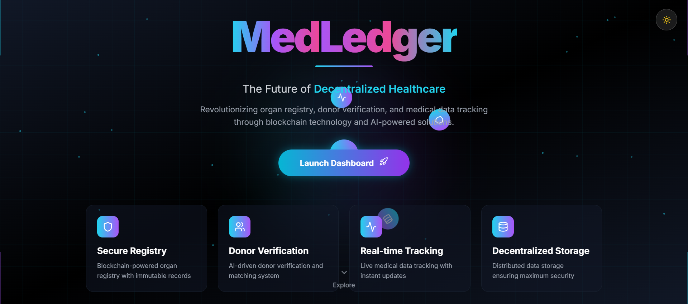
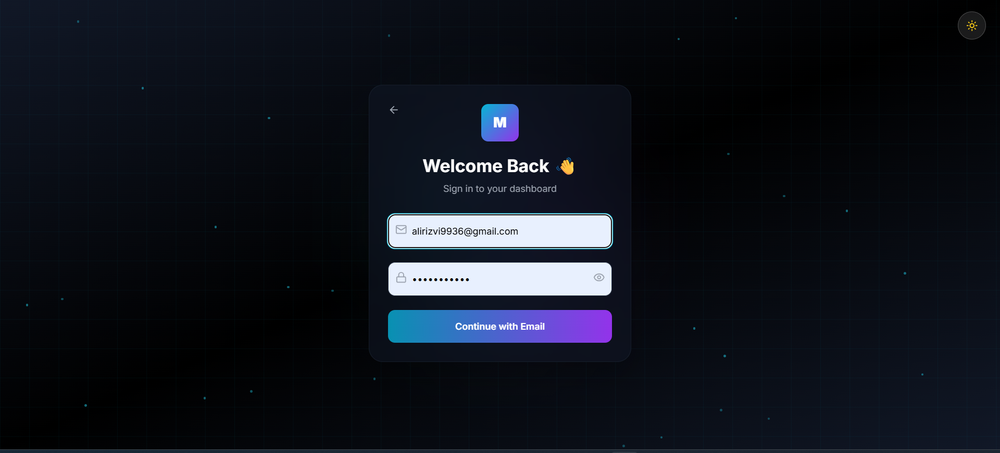
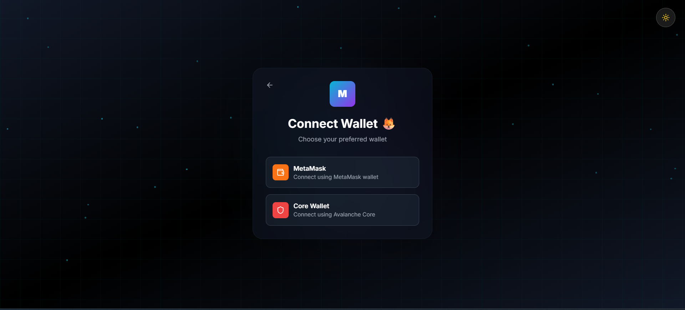
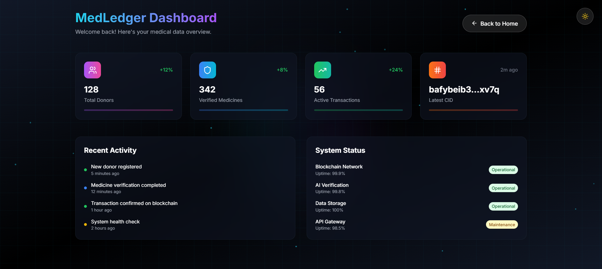
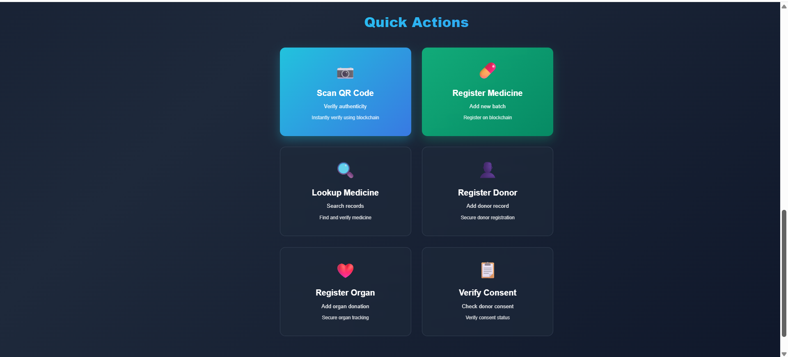
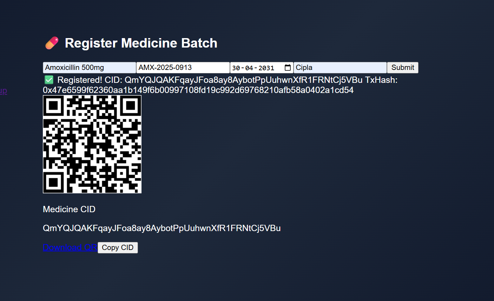
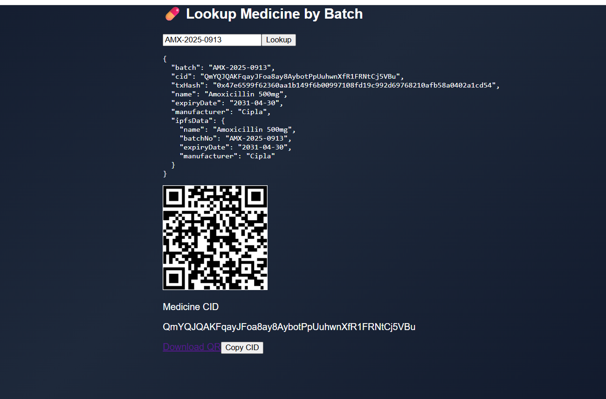

# 🧬 MedLedger2 – Blockchain-Powered Medicine Verification

> A full-stack decentralized platform to verify **medicine authenticity** using **IPFS, Smart Contracts, and QR-based lookup**.  
Built by **Team Forzentix** at hackathon speed ⚡.

 <!-- Replace with your actual project image -->

---

## 🚀 Live Demo & Links

- 🎥 [Demo Video](https://www.youtube.com/watch?v=fKKN6VTCdyw)  
- 🌐 [Try the App](https://medledger2.vercel.app)  
- 🧑‍💻 [Team Portfolio](https://forzentix.vercel.app)  

---

## 🛠️ Tech Stack

- **Frontend**: React.js, TailwindCSS  
- **Backend**: Node.js, Express.js  
- **Blockchain**: Ethers.js + Avalanche Fuji Testnet  
- **Storage**: IPFS (Pinata Gateway)  
- **QR**: Dynamic QR rendering for CID lookup  

---

## 📦 Features

✅ Register new medicine batches with **CID + txHash**  
✅ Lookup by **Batch Number** or **CID**  
✅ Fetch metadata directly from **IPFS** (with fallback)  
✅ **QR-based traceability** – scan to verify instantly  
✅ Sleek **Dark/Light UI Toggle** for judges & users  
✅ **Hackathon-friendly modular architecture**  

---

## 🖼️ Screenshots
### 🧭  Welcome Page  


### 🧭 Sign Up  


### 🧭 Wallet Connect 


### 📚 Dashbord  


### 📚 Quick Actions 


### 📚 Medicine Registration  


### 🔐 Medicine Validation  


### 📊 Admin Dashbord  


### 📊 Add Member 


### 📦 Transaction Logs  

---

## 📂 Folder Structure

```bash
├── backend
│   ├── routes
│   └── server.js
├── frontend
│   ├── pages
│   └── components
├── data
│   └── medicineIndex.json
