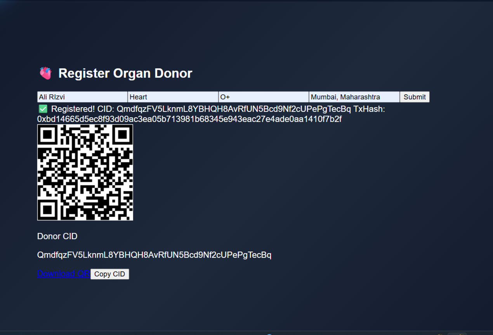
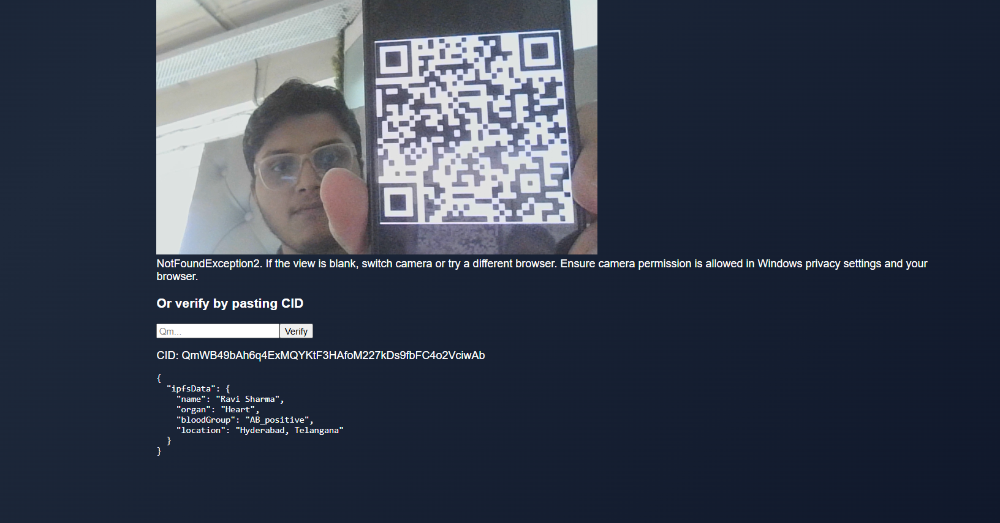

# 🧬 MedLedger – Blockchain-Powered Medicine Verification

> A Web3 decentralized platform to verify **medicine authenticity** using **IPFS, Smart Contracts, and QR-based lookup**.  
Built by **Team Forzentix** at hackathon speed ⚡.

 <!-- Replace with your actual project image -->

---

## 🚀 Live Demo & Links

- 🎥 [Demo Video](https://www.youtube.com/playlist?list=PL6pVu-pne8klSWW_iv24CR9ELjpiN29qN)  
- 🌐 [Try the App](https://medledger2.vercel.app)  
- 🧑‍💻 [Team Portfolio](https://forzentix.vercel.app)  

---

## 🛠️ Tech Stack

- **Frontend**: React.js, TailwindCSS  
- **Backend**: Node.js, Express.js  
- **Blockchain**: Ethers.js + Avalanche Fuji Testnet  
- **Storage**: IPFS (Pinata Gateway)  
- **QR**: Dynamic QR rendering for CID lookup  

---

## 📦 Features

✅ Register new medicine batches with **CID + txHash**  
✅ Lookup by **Batch Number** or **CID**  
✅ Fetch metadata directly from **IPFS** (with fallback)  
✅ **QR-based traceability** – scan to verify instantly  
✅ Sleek **Dark/Light UI Toggle** for judges & users  
✅ **Hackathon-friendly modular architecture**  

---

## 🖼️ Screenshots
### 🧭  Welcome Page  


### 🧭 Sign Up  


### 🧭 Wallet Connect 


### 📚 Dashbord  


### 📚 Quick Actions 


### 📚 Medicine Registration  


### 🔐 Medicine Validation  


### 📊 Register Organ  


### 📊 Qr Scan 


---

## 📂 Folder Structure

```
MedLedger/
├── backend/
|     ├── node_modules/          # Python cache files (ignored) 
|     ├── abi/
|     ├── artifacts/
|     ├── cache/
|     ├── config/
|     |     └── contract.js
|     ├── contracts/
|     |     └── MedLedger.sol
|     |     └── MedLedgerDonor.sol
|     |     └── MedLedgerOrgan.sol
|     ├
|     ├── data/
|     ├── routes/
|     |     └── api.js
|     |     └── consent.js
|     |     └── donor.js
|     |     └── donorInfo.js
|     |     └── donorLookup.js
|     |     └── medicine.js
|     |     └── medicineLookup.js
|     |     └── organ.js
|     |     └── stats.js
|     |     └── verify.js
|     |     
|     ├── scripts/
|     |     └── deploy.js
|     ├── scripts/
|     |     └── blockchain.js
|     |     └── ipfs.js
|     |     └── pintaUploader.js
|     |      
|     ├── test/
|     ├── utils/
|     |     └── uploadToIPFS.js
|     ├── .env
|     ├── env.js
|     ├── package.lock.json
|     ├── hardhat.config.js
|     ├── pakage.json
|     └── server.js
|
|
├── frontend/
|     ├── node_modules/           
|     ├── public/    
|     ├── src/      
|     |     ├── components/
|     |     |     └──  BlobBackground.jsx
|     |     |     └──  DashbordsStats.jsx
|     |     |     └──  DashbordsSystem.jsx
|     |     |     └──  QRViewer.css
|     |     |     └──  QRVivewr.jsx
|     |     |     └──  Lucidelcons.jsx
|     |     |     └──  StatsDashbord.jsx
|     |     |
|     |     |
|     |     ├── pages/
|     |     |     └──  ConsentVerify.jsx
|     |     |     └──  Dashboard.jsx
|     |     |     └──  DonerLookup.jsx
|     |     |     └──  Login.jsx
|     |     |     └──  MedicineLookup.jsx
|     |     |     └──  Registerbatch.jsx
|     |     |     └──  RegisterOrgan.jsx
|     |     |     └──  ScanQr.jsx
|     |     |     └──  ScanVerify.jsx
|     |     |     └──  Welcome.jsx
|     |     |
|     |     ├── app.css
|     |     ├── App.jsx
|     |     ├── index.css
|     |     └── main.jsx
|     |
|     ├──.gitignore
|     ├──package-lock.json
|     ├──package.json
|     ├──postcss.config.js
|     ├──tailwind.config.js
|     └──README.md
|
├──screenshots/
└──README.md
```
---
## 🧪 Run Locally

# Clone repo
git clone https://github.com/yourusername/medledger2

# Start Backend
cd backend
npm install
node server.js

# Start Frontend
cd ../frontend
npm install
npm run dev

---

## 🛡️ Security & Reliability

🔐 Private key handling with dotenv
🧪 Reproducible smart contract calls
📈 Benchmarked against traceability standards
⚡ Gas-efficient & IPFS-resilient storage

---

## 👨‍💻 Team Forzentix

# Name	             #Role	           #GitHub
Ali Rizvi	   Backend Architect      	@ali-rizvi

[Teammate 2]	Frontend Lead	[GitHub]
[Teammate 3]	Blockchain Dev	[GitHub]
 

